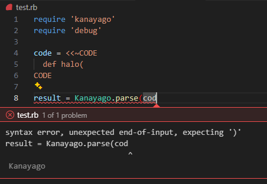
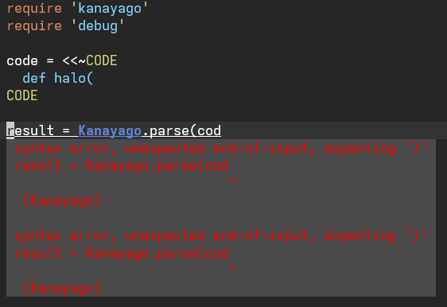

# Kanayago(金屋子)

Trying to Make Ruby's Parser Available as a Gem.

## Support Ruby version

Kanayago(金屋子)　is supported Ruby 3.4 or Ruby head.

## Installation
### From RubyGems

```
gem install kanayago
```

### Build and Install in local

First, clone this repository.

```console
git clone https://github.com/S-H-GAMELINKS/kanayago.git
```

Move `kanayago` directory, and run `bundle install`.

```console
cd kanayago && bundle install
```

Finally, build `Kanayago` gem  and install it.

```console
bundle exec rake build
gem install pkg/kanayago-0.6.1.gem
```

## Usage

### Ruby API

```ruby
require 'kanayago/kanayago'

result = Kanayago.parse('117 + 117')
# => #<Kanayago::ParseResult:0x00007f522199c5a8>

p result.ast
# => #<Kanayago::ScopeNode:0x00007f522199c5a8>

p result.ast.body
# => #<Kanayago::OperatorCallNode:0x00007f5221b06358>

p result.ast.body.recv
p result.ast.body.recv.val
# => #<Kanayago::IntegerNode:0x00007f5221b06330>
# => 117

# Check for syntax errors
result = Kanayago.parse('def foo')
p result.valid?
# => false
p result.error
# => #<SyntaxError: syntax error, unexpected end-of-input>
```

### Language Server Protocol (LSP) Mode

Kanayago provides LSP server support for real-time syntax checking in your editor:

```bash
# Start LSP server
$ kanayago --lsp
```

This starts an LSP server that communicates via stdin/stdout. You can integrate it with LSP-compliant editors like VSCode, Vim, Emacs, etc.

#### VSCode Integration

Install the official VSCode extension from the marketplace:

1. Open VSCode and search for "VSCode Kanayago" in the Extensions view
2. Click Install

**Configuration:**

```json
{
  "kanayago.serverPath": "kanayago",
  "kanayago.trace.server": "off"
}
```

Now VSCode will show syntax errors in real-time as you type Ruby code.



#### Vim/Neovim with coc.nvim Integration

##### Using coc-kanayago Extension (Recommended)

Install the official coc.nvim extension:

```vim
:CocInstall coc-kanayago
```

**Configuration:**

Add the following to your `coc-settings.json` (`:CocConfig` in Vim):

```json
{
  "coc-kanayago.enable": true,
  "coc-kanayago.command": "kanayago"
}
```

**Diagnostic Navigation:**

The extension supports standard coc.nvim diagnostic keybindings:
- Next diagnostic: `<space>dn`
- Previous diagnostic: `<space>dp`
- Show diagnostic info: `<space>di`

See [coc-kanayago](https://github.com/S-H-GAMELINKS/coc-kanayago) for more details.



##### Manual LSP Configuration

Alternatively, you can configure the LSP server manually in your `coc-settings.json`:

```json
{
  "languageserver": {
    "kanayago": {
      "command": "kanayago",
      "args": ["--lsp"],
      "filetypes": ["ruby"],
      "rootPatterns": ["Gemfile", ".git"]
    }
  }
}
```

Now Vim/Neovim with coc.nvim will show syntax errors in real-time as you edit Ruby files.

#### Emacs Integration

If you're using Emacs with lsp-mode, add the following configuration to your `init.el`:

```elisp
(require 'lsp-mode)

;; Register Kanayago LSP server
(lsp-register-client
 (make-lsp-client
  :new-connection (lsp-stdio-connection '("kanayago" "--lsp"))
  :major-modes '(ruby-mode enh-ruby-mode)
  :server-id 'kanayago-lsp
  :priority 10))

;; Enable lsp-mode for Ruby files
(add-hook 'ruby-mode-hook #'lsp-deferred)
```

Kanayago will automatically check your Ruby code for syntax errors and display diagnostics in real-time.

#### Helix Integration

Add the following configuration to your `~/.config/helix/languages.toml`:

```toml
[[language]]
name = "ruby"
language-servers = ["kanayago"]

[language-server.kanayago]
command = "kanayago"
args = ["--lsp"]
```

If you already have a Ruby language configuration, you can add `"kanayago"` to your existing language-servers array:

```toml
[[language]]
name = "ruby"
language-servers = ["kanayago", "solargraph"]  # Use alongside other LSPs

[language-server.kanayago]
command = "kanayago"
args = ["--lsp"]
```

Now Helix will show syntax errors in real-time as you edit Ruby files.

#### Zed Integration

Install the official Zed extension from the marketplace:

1. Open Zed and go to Extensions (`cmd/ctrl + shift + x`)
2. Search for "Kanayago"
3. Click Install

**Manual Installation:**

If you prefer to install manually or for development purposes:

```bash
git clone https://github.com/S-H-GAMELINKS/zed-kanayago.git
cd zed-kanayago
```

Then follow the [Zed extension development guide](https://zed.dev/docs/extensions) for installation.

**Requirements:**
- Kanayago must be installed and available in your PATH
- Zed will automatically start the LSP server when opening Ruby files

See [zed-kanayago](https://github.com/S-H-GAMELINKS/zed-kanayago) for more details.

### Command Line Interface

Kanayago provides a CLI for syntax checking:

```bash
# Check Ruby code directly
$ kanayago check 'p 117'
Syntax valid

# Check Ruby code with syntax error
$ kanayago check 'def foo'
Syntax invalid

# Check a Ruby file
$ kanayago check --file test.rb
Syntax valid

# Or use the short option
$ kanayago check -f test.rb
Syntax valid
```

The CLI exits with code 0 for valid syntax and code 1 for invalid syntax or errors.

## Development

After checking out the repo, run `bin/setup` to install dependencies. You can also run `bin/console` for an interactive prompt that will allow you to experiment.

To install this gem onto your local machine, run `bundle exec rake install`. To release a new version, update the version number in `version.rb`, and then run `bundle exec rake release`, which will create a git tag for the version, push git commits and the created tag, and push the `.gem` file to [rubygems.org](https://rubygems.org).

### Running Tests

```bash
# Run unit tests (excludes integration tests)
bundle exec rake test

# Run integration tests (requires repository setup)
bundle exec rake integration:setup    # Clone test repositories (Rails, Discourse, Mastodon, GitLab)
bundle exec rake integration:test     # Run integration tests

# Clean up cloned repositories
bundle exec rake integration:clean

# Update cloned repositories to latest
bundle exec rake integration:update
```

The integration tests verify that Kanayago can successfully parse real-world Rails codebases including Rails itself, Discourse, Mastodon, and GitLab. These tests help ensure compatibility with production Ruby code patterns.

## Contributing

Bug reports and pull requests are welcome on GitHub at https://github.com/S-H-GAMELINKS/kanayago.

## Referenced implementations

[yui-knk/ruby-parser](https://github.com/yui-knk/ruby-parser)

## License

The gem is available as open source under the terms of the [MIT License](https://opensource.org/licenses/MIT).
